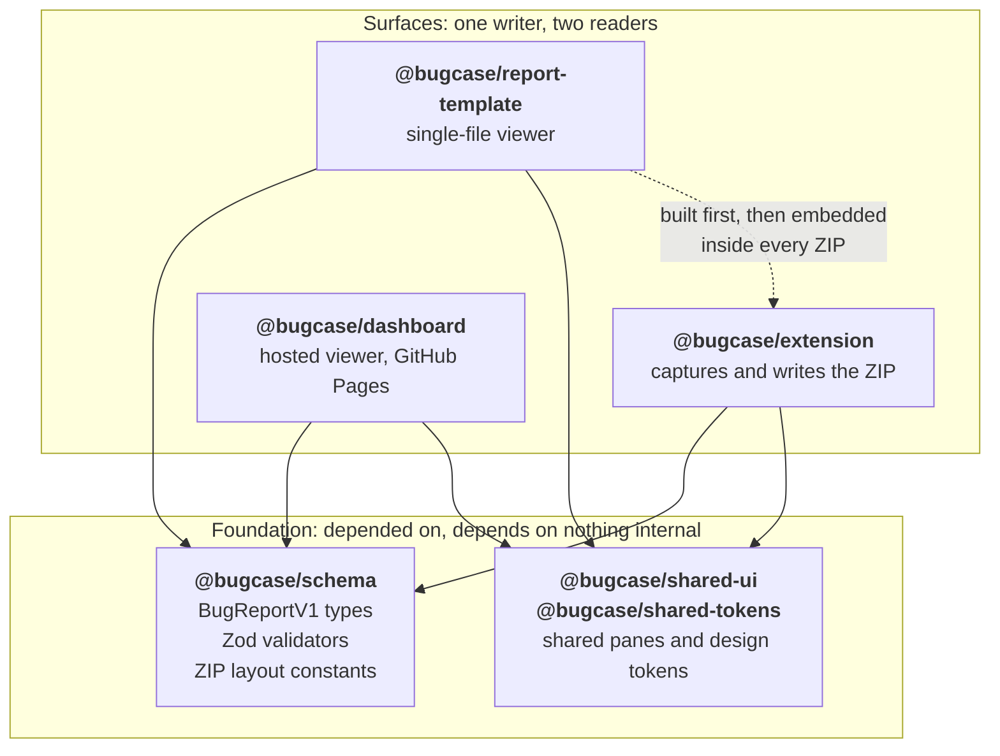
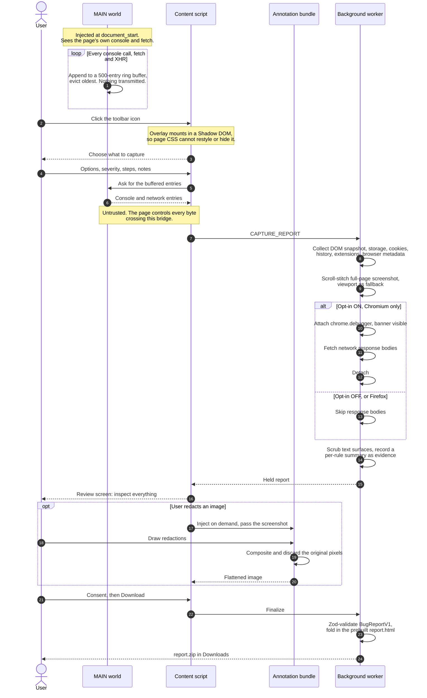
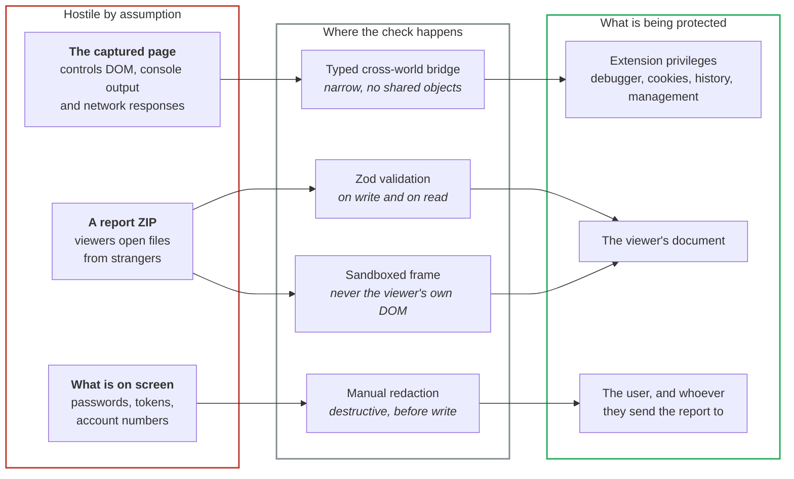

# Architecture

How BugCase is put together, and why.

If you are here to make a change, the shortest useful summary is: **the extension captures, the
schema is the contract, and two different viewers render the result.** Almost every design
constraint in this repo follows from having no backend.

## The central constraint

BugCase has **no server, no account, and no telemetry**. Nothing is uploaded. That single choice
explains most of what follows:

- A report has to be a **file**, because there is nowhere to store it. Hence the ZIP.
- A report has to be **viewable without us**, forever, hence the self-contained `report.html`.
- The report format has to be **validated on both sides**, because there is no server in the
  middle to normalize anything. Hence a shared Zod schema.
- Redaction has to happen **before the file is written**, because once a user shares a ZIP we
  cannot reach it. Hence destructive redaction rather than a display-time overlay.
- Sensitive capture has to be **opt in at runtime**, because there is no backend policy to
  enforce it later. Hence optional permissions.

## Packages

A pnpm monorepo. Each package has one responsibility, and the dependency arrows only point one way.



Solid arrows read "depends on". They all point one way, into the foundation, and nothing in the
foundation points back out. The dotted edge is the awkward one worth knowing about: the report
template is **both** a build-time dependency of the extension **and** an independent reader of the
same format. A change to the report format has to land in the writer and both readers at once, which
is most of why these share one repo.

| Package                    | Responsibility                                                                  |
| -------------------------- | ------------------------------------------------------------------------------- |
| `packages/schema`          | `BugReportV1` types, Zod validators, ZIP layout constants. The shared contract. |
| `packages/extension`       | MV3 extension: capture UI, capture engine, scrubbers, ZIP writer.               |
| `packages/dashboard`       | Hosted viewer. Renders any report ZIP entirely in the browser.                  |
| `packages/report-template` | Builds the self-contained `report.html` embedded in every ZIP.                  |
| `packages/shared-ui`       | Components used by more than one surface (lightbox, sandboxed HTML, panes).     |
| `packages/shared-tokens`   | Design tokens shared across extension, dashboard, and report.                   |
| `apps/privacy-site`        | Hosted legal pages, folded into the Pages deploy at `/legal/`.                  |

**`shared-ui` exists to prevent divergence, not to save typing.** The DOM-snapshot sandbox is the
clearest case: it is security-critical, and two copies would eventually differ. One copy, used by
both viewers.

## Capture flow



Three things this shows that prose keeps burying. The **ring buffer runs before anyone asks**, which
is the only reason a report can contain the error that prompted it. The **debugger branch is the
exception, not the path**, and it is the one step a user must switch on. And the **annotation bundle
is a separate injected surface**, which is a bundle-size decision, not an accident.

**Two worlds, one bridge.** Console and network interception must run in the page's **MAIN** world
to see the page's own `console` and `fetch`/`XHR`. Extension logic runs in the **isolated** world.
They communicate over a narrow, typed bridge rather than sharing objects, so a hostile page cannot
reach into extension privileges by tampering with what it hands across.

**Ring buffers are always on; heavy capture is not.** Console and network entries accumulate in
bounded in-memory ring buffers from `document_start`, because a bug you did not anticipate cannot
be recorded retroactively. Expensive and invasive work (debugger attach, full-page screenshots,
cookies, storage) happens only on demand, with consent.

## The report format

A report is a ZIP. That is the whole distribution mechanism.

```
report.zip
├─ report.json      BugReportV1, Zod-validated on write and on read
├─ report.html      self-contained viewer, zero network requests
└─ assets/          screenshots, element crops, DOM snapshot
```

`report.json` is the contract. `packages/schema` validates it when the extension writes it and
again when a viewer reads it, so a malformed report can neither be produced nor silently
misrendered. The schema is **additive only**: new fields are optional, so a v1.0 viewer can still
open a report written by a later version.

`report.html` matters more than it looks. A hosted dashboard is a dependency on us continuing to
exist. A single HTML file with everything inlined is not.

## Trust boundaries



⚠️ **The bottom row is the weak one.** The first three checks are code and hold automatically. The
fourth is a human deciding to redact, and it fails whenever someone is in a hurry. That is a known,
accepted limitation, not an oversight: see [SECURITY.md](./SECURITY.md) for why the automatic
version was tried and reverted.

The same edges in the order an attacker would meet them:

1. **The captured page is hostile.** It controls the DOM, the console output, and the network
   responses that end up in a report. Everything crossing the MAIN-world bridge is untrusted
   input.
2. **A report ZIP is hostile.** Viewers open files from strangers. `report.json` is schema
   validated, and the DOM snapshot is rendered in a sandboxed frame, never injected into the
   viewer's own document.
3. **The extension's elevated permissions are the prize.** `debugger`, `cookies`, `history`, and
   `management` are what an attacker wants. `debugger` is install-time because Chrome forbids it
   in `optional_permissions`, so it is gated behind a stored opt-in that defaults to off. The rest
   are genuinely optional and requested at runtime.
4. **The user's own screen is a leak channel.** Screenshots are rendered pixels. Scrubbers operate
   on text and cannot reach them. This is stated plainly rather than papered over; see
   [SECURITY.md](./SECURITY.md).

## Cross-browser strategy

One codebase, two build targets, differences kept behind small helpers rather than scattered
`if (isFirefox)` checks through UI code.

| Concern            | Chrome                  | Firefox                                     |
| ------------------ | ----------------------- | ------------------------------------------- |
| Background         | MV3 service worker      | Event page                                  |
| Network bodies     | `chrome.debugger` (CDP) | Unavailable; step is skipped                |
| Downloads          | `URL.createObjectURL`   | Blob object URL (`data:` URLs are rejected) |
| Permission prompts | Works from the worker   | Must be requested from the popup (gesture)  |

**Firefox builds but is not published.** `pnpm build:firefox` produces a working extension, and CI
gates it on every commit (`scripts/check-firefox-lint.mjs`), but the AMO listing is deferred. The
gate exists precisely because parked work rots: without it, nothing in CI would ever build the
Firefox target.

## Testing strategy

| Layer         | Tool               | What it protects                                               |
| ------------- | ------------------ | -------------------------------------------------------------- |
| Unit          | Vitest             | Scrubber rules, schema validators, collectors, pure helpers    |
| Integration   | Vitest             | Capture engine end to end, ZIP round-trips                     |
| E2E           | Playwright         | Real capture in a real browser, real ZIP, real download        |
| Visual        | Playwright         | Preview-screen regressions (opt in, platform-pinned baselines) |
| Accessibility | axe via Playwright | Every dashboard pane, light and dark                           |
| Workflow      | Vitest             | CI/release workflow contracts and build-gate scripts           |

Playwright can only load MV3 extensions in Chromium, so the `firefox` project asserts that
**artifacts** render correctly in Gecko rather than driving the extension. Firefox extension
runtime checks are a manual `web-ext` procedure (`qa/manual-site-checklist.md`).

## Build and release

- **Vite + `@crxjs/vite-plugin`** builds the extension; `BROWSER=chrome|firefox` selects the target.
- Output lands in `packages/extension/dist-chrome/` and `dist-firefox/`, **not** a root `dist/`.
- Packaging produces a single Chromium ZIP used for Chrome, Edge, and Brave.
- The release pipeline is **reproducibility-gated**: it builds, hashes, rebuilds, re-hashes, and
  fails if the two differ. The store artifact, the GitHub Release asset, and the recorded SHA-256
  are the same bytes.

## Where the rationale lives

The "why" behind the choices above is spread through this document deliberately, closest to the
thing it explains: [the central constraint](#the-central-constraint) for the no-backend
consequences, [capture flow](#capture-flow) for the two-tier capture design,
[trust boundaries](#trust-boundaries) for the permission model, and
[cross-browser strategy](#cross-browser-strategy) for the Firefox position.
