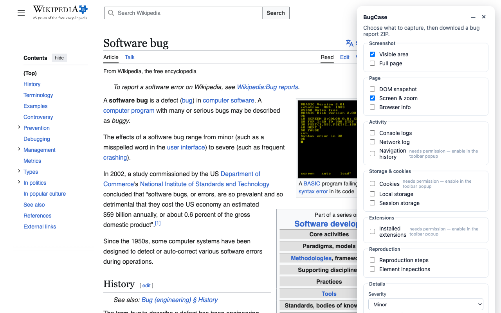
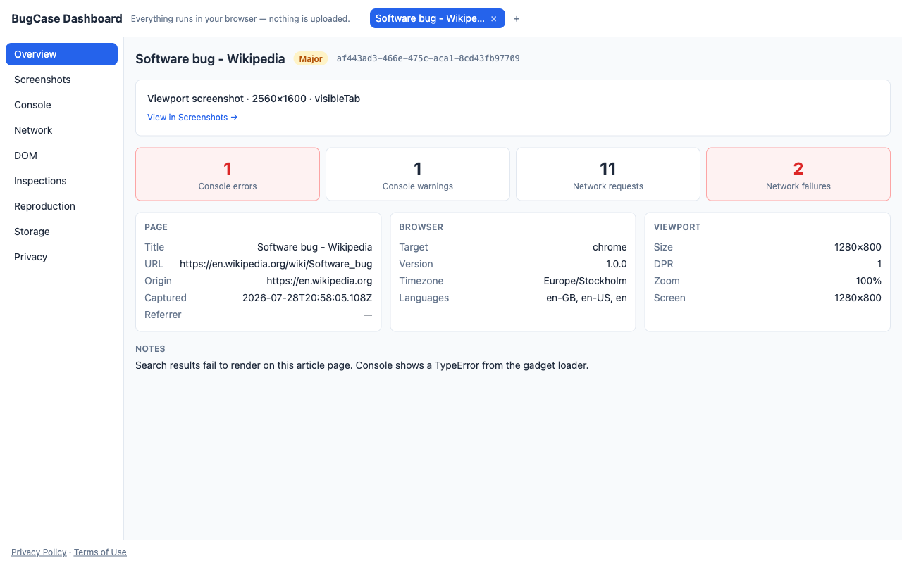
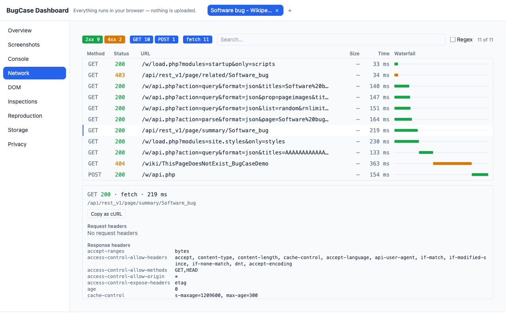
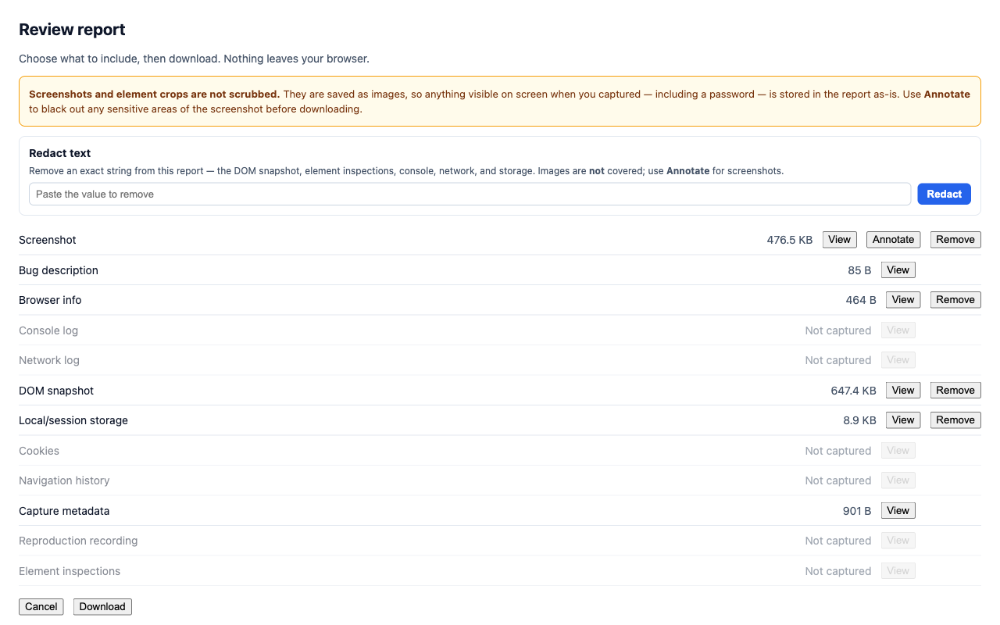
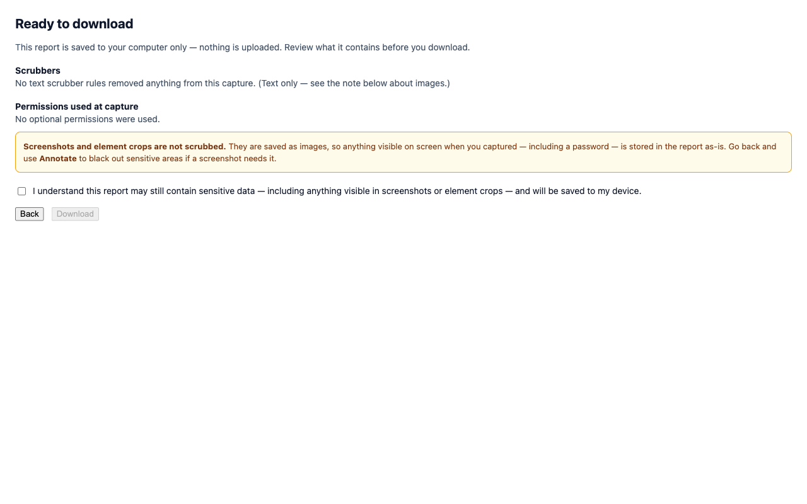
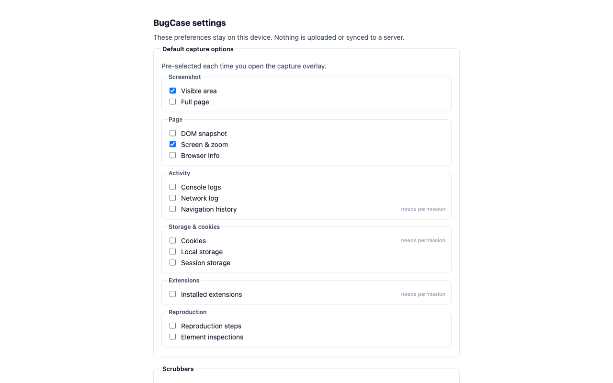
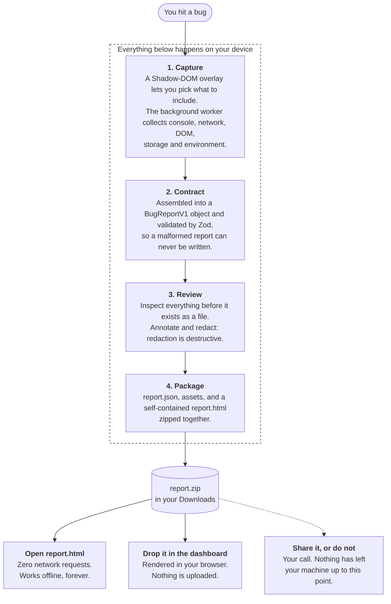

<p align="center">
  
</p>

<h1 align="center">BugCase</h1>

<p align="center">
  A privacy-first browser extension that captures a complete, shareable bug report
  (console, network, DOM, screenshots, and more) as a single ZIP. No backend. No telemetry.
</p>

<p align="center">
  <a href="./LICENSE"></a>
  = 22.13" src="https://img.shields.io/badge/node-%3E%3D22.13-339933?logo=node.js&logoColor=white" />
  = 9" src="https://img.shields.io/badge/pnpm-%3E%3D9-F69220?logo=pnpm&logoColor=white" />
  
  <a href="https://github.com/bisensamiksha/BugCase/actions/workflows/ci.yml"></a>
</p>

<p align="center">
  <a href="https://chromewebstore.google.com/detail/inbgbkepikijkgeagehcbaofambgcdck"><strong>Install for Chrome</strong></a> ·
  <a href="https://bisensamiksha.github.io/BugCase/">Dashboard</a> ·
  <a href="https://bisensamiksha.github.io/BugCase/legal/privacy-policy">Privacy Policy</a> ·
  <a href="https://bisensamiksha.github.io/BugCase/legal/terms">Terms of Use</a> ·
  <a href="./ARCHITECTURE.md">Architecture</a> ·
  <a href="./CONTRIBUTING.md">Contributing</a> ·
  <a href="./SECURITY.md">Security</a>
</p>

---

## Install

**[Get BugCase on the Chrome Web Store][store]** (also works in Edge and Brave if you load it
unpacked; see [Browser support](#browser-support)).

Prefer to build it yourself? See [Getting started](#getting-started).

## About the project

Reproducing a bug from a vague description is hard. **BugCase** turns "it's broken on my
machine" into a self-contained evidence package: click the toolbar icon, choose what to
include, and BugCase captures the page's console logs, network traffic, DOM snapshot,
screenshots, storage, and environment into a single downloadable **ZIP**.

Everything runs **on your device**. There is no server, no account, and no telemetry: the
report is generated locally and saved to your Downloads folder. You decide if and where to
share it. Each ZIP also embeds a **self-contained `report.html`** that opens the whole report
in a browser with **zero network requests**, and a companion **dashboard** (hosted on GitHub
Pages) can render any ZIP entirely in the browser.

## Why BugCase

- **Privacy by architecture, not by policy.** No backend means there is nothing to upload,
  log, or leak. Optional permissions are requested at runtime with explicit consent and can
  always be declined.
- **Honest about redaction.** Text surfaces (page HTML, cookies, headers) are scrubbed
  automatically. Screenshots and element crops are rendered pixels and are **not**
  auto-scrubbed. BugCase says so plainly and gives you a manual redaction tool.
- **Portable evidence.** A report is just a ZIP with a schema-validated `report.json` and a
  `report.html` that works offline forever, with no proprietary viewer required.
- **Cross-browser.** One codebase targets Chrome, Edge, and Firefox, with browser
  differences kept behind small helpers.

## Features

**Capture**

- Console and network activity via always-on ring buffers, with on-demand full response
  bodies and full-page screenshots (Chrome DevTools Protocol, with a scroll-stitch fallback)
- DOM snapshot, viewport + full-page screenshots, and point-and-click **element inspection**
  (computed styles, HTML, and a cropped image of the element)
- Cookies, local/session storage, navigation history, installed extensions, and rich
  environment metadata (browser, screen, device-pixel-ratio, zoom)
- A reproduction-steps recorder and a passive error-detection badge

**Review & redact**

- A preview screen to inspect everything before it leaves your device
- Konva-powered annotation canvas for **destructive** redaction of sensitive regions in
  screenshots (the original pixels are discarded, not hidden)
- Per-rule scrubber summary and a privacy pane showing exactly what was removed and which
  permissions were held at capture

**Share & view**

- One ZIP containing `report.json`, all assets, and a self-contained `report.html`
- A GitHub Pages **dashboard** with panes for overview, console, network, DOM, screenshots,
  reproduction, element inspections, storage, and privacy, all rendered in your browser

## Screenshots

|                                                                                                                                                                                                         |                                                                                                                                                                                                  |
| ------------------------------------------------------------------------------------------------------------------------------------------------------------------------------------------------------- | ------------------------------------------------------------------------------------------------------------------------------------------------------------------------------------------------ |
| <br>**Capture.** Pick what to include, on any page.            | <br>**Overview.** The report at a glance. |
| <br>**Network.** Requests, timings, headers, bodies. | <br>**Review and redact.** Before anything is written.         |
| <br>**Consent.** Evidence of what was removed.             | <br>**Settings.** Defaults, opt-ins, allowlist.                                                                |

## Privacy & legal

BugCase runs entirely on your device: no backend, no telemetry, no accounts. Reports are
generated locally and saved to your Downloads folder; nothing is uploaded by BugCase.

- **Privacy Policy:** <https://bisensamiksha.github.io/BugCase/legal/privacy-policy>
- **Terms of Use:** <https://bisensamiksha.github.io/BugCase/legal/terms>

> Screenshots and element crops are stored as rendered images and are **not** auto-scrubbed.
> Only text surfaces (page HTML, cookies, headers) are. Redact sensitive regions by hand
> before sharing a report.

## Built with

TypeScript · React · Vite · [`@crxjs/vite-plugin`](https://crxjs.dev/vite-plugin) (Manifest V3)
· Tailwind CSS · [Zod](https://zod.dev) · [JSZip](https://stuk.github.io/jszip/) · Konva ·
Shiki · Vitest · Playwright · ESLint 9 · Prettier · pnpm workspaces

## Project structure

BugCase is a pnpm monorepo. Each package has one clear responsibility.

```text
BugCase/
├─ packages/
│  ├─ extension/        # MV3 browser extension (Chrome + Firefox): capture UI + engine
│  ├─ dashboard/        # GitHub Pages report viewer: renders a ZIP entirely in-browser
│  ├─ report-template/  # Single-file, self-contained report.html build (embedded in each ZIP)
│  ├─ schema/           # BugReportV1 types + Zod validators + ZIP layout (shared contract)
│  └─ shared-ui/        # UI/logic shared by the extension and the dashboard
├─ apps/
│  └─ privacy-site/     # Hosted legal pages (privacy policy + terms) → /legal/
├─ scripts/             # Build, packaging, icon, reproducibility, and CI-gate utilities
├─ tests/               # Playwright E2E specs + CI workflow contract tests
├─ qa/                  # Manual QA site checklist + results template
├─ store/  legal/       # Store listings, screenshots, release tracker + legal review notes
└─ design/              # Icon source (SVG) + generator
```

For how the pieces fit together and why, see **[ARCHITECTURE.md](./ARCHITECTURE.md)**.

## Getting started

### Prerequisites

- **Node.js `>= 22.13.0`** (see [`.nvmrc`](./.nvmrc))
- **pnpm `>= 9`**: `corepack enable` will pin the version from `package.json`

### Install

```bash
git clone https://github.com/bisensamiksha/BugCase.git
cd BugCase
pnpm install
```

### Build & load the extension

```bash
pnpm build:chrome     # → packages/extension/dist-chrome
pnpm build:firefox    # → packages/extension/dist-firefox
```

- **Chrome / Edge:** open `chrome://extensions`, enable **Developer mode**, click **Load
  unpacked**, and select `packages/extension/dist-chrome`.
- **Firefox:** open `about:debugging#/runtime/this-firefox`, click **Load Temporary
  Add-on**, and select `packages/extension/dist-firefox/manifest.json`.

Then click the BugCase toolbar icon on any page to start a capture.

### Run the dashboard

Use the hosted viewer at <https://bisensamiksha.github.io/BugCase/>, or run it locally and
drag a report ZIP onto the drop zone:

```bash
pnpm --filter @bugcase/dashboard dev
```

## Development & testing

| Command                                    | What it does                           |
| ------------------------------------------ | -------------------------------------- |
| `pnpm install`                             | Install all workspace dependencies     |
| `pnpm build`                               | Build every package                    |
| `pnpm build:chrome` / `pnpm build:firefox` | Build the extension for one target     |
| `pnpm --filter @bugcase/dashboard dev`     | Run the dashboard locally with HMR     |
| `pnpm -r typecheck`                        | TypeScript across all packages         |
| `pnpm -r test`                             | Vitest unit + integration tests        |
| `pnpm test:e2e`                            | Playwright end-to-end tests            |
| `pnpm lint`                                | ESLint 9 (run from the repo root)      |
| `pnpm format`                              | Prettier write                         |
| `pnpm check:no-em-dash`                    | Gate on em dashes in user-visible copy |
| `node scripts/check-firefox-lint.mjs`      | Firefox parity gate (see below)        |

> **Note:** lint with the **root** `pnpm lint`. Per-package `lint` scripts are known-broken
> and should not be used.

### The Firefox parity gate

CI builds the Firefox target on every PR and runs `web-ext lint` over it. The gate is a
**ratchet**: any lint _error_ fails the build, and the _warning_ count may not rise above the
number recorded in [`scripts/firefox-lint-baseline.json`](./scripts/firefox-lint-baseline.json).

It exists because Firefox is built but published nowhere. `pnpm build` resolves to the Chrome
target, so before this gate nothing in CI ever compiled the Firefox build, and it could have
broken silently for months. Run it yourself with:

```bash
pnpm build:firefox && node scripts/check-firefox-lint.mjs
```

If you fix something that lowers the warning count, lower the baseline in the same PR. The
baseline is an honest record of how far the Firefox build is from being publishable, so please do
not silence warnings to make it go down.

## How it works



There is no step where a report is uploaded, because there is no server to upload it to. The dotted
edge is the only one that can send data anywhere, and you are the one who takes it.

## Browser support

| Browser | Status                       | Notes                                                                       |
| ------- | ---------------------------- | --------------------------------------------------------------------------- |
| Chrome  | ✅ **Published**             | Primary target. Install from the [Chrome Web Store][store].                 |
| Edge    | 🟡 Compatible, not published | Chromium, runs the same build; load it unpacked (see above).                |
| Brave   | 🟡 Compatible, not published | Chromium, runs the same build; load it unpacked.                            |
| Firefox | 🟡 Builds, not published     | `build:firefox` works and is CI-gated, but there is no AMO listing **yet**. |

**Chrome is the only browser BugCase is published on.** Everything else builds and runs, but you
have to load it unpacked yourself.

Two honest caveats if you use the Firefox build:

- **No network response bodies.** Firefox has no equivalent of `chrome.debugger`, so that capture
  step is skipped. Full-page screenshots fall back to scroll-stitch.
- **It has never been through the manual QA sweep.** The 39-site pass that gated the Chrome
  release was Chrome-only, and Playwright cannot load MV3 extensions in Firefox, so no automated
  test exercises the capture engine there either.

Firefox and Edge publication are deferred rather than abandoned. The work is scoped and ready; it
is waiting on Chrome showing enough demand to justify a second store.

[store]: https://chromewebstore.google.com/detail/inbgbkepikijkgeagehcbaofambgcdck

## Contributing

Contributions are welcome. Please read [`CONTRIBUTING.md`](./CONTRIBUTING.md) and the
[`CODE_OF_CONDUCT.md`](./CODE_OF_CONDUCT.md) first. In short:

1. Fork the repo and create a feature branch.
2. Make your change with tests (`pnpm -r test`) and keep `pnpm -r typecheck` + `pnpm lint`
   green.
3. Run the manual QA checklist in [`qa/`](./qa) when your change affects capture behavior.
4. Open a focused pull request describing the change and how you verified it.

## Security

Found a vulnerability? **Please do not open a public issue.** Report it privately through
[GitHub Security Advisories](https://github.com/bisensamiksha/BugCase/security/advisories/new).
See [`SECURITY.md`](./SECURITY.md) for scope, what to include, and response expectations.

## License

**Source-available, not open source.** BugCase is licensed under the
[PolyForm Small Business License 1.0.0](./LICENSE), free to use and modify for small
businesses and individuals (see the license for the exact thresholds). See also
[`NOTICE`](./NOTICE) for the required attribution.
